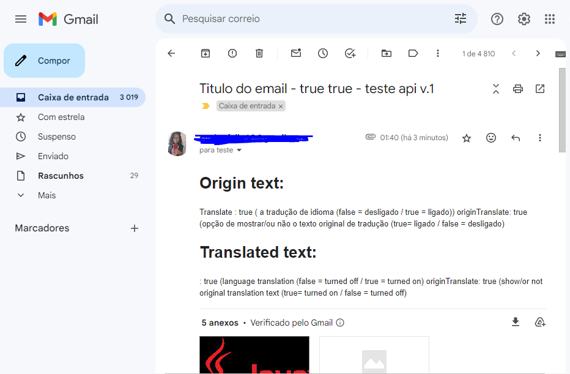

# Sender-Gmail
App for sending to gmail, with the option to translate the message from Brazilian Portuguese to English
Send email to email list with lists of pdfs, images and media.

* Spring Boot
* Java Mail
* Free translation API
* Free Email API translation
* SOLID concepts and practices


</br>
</br>
 
### Postman
</img>
</br>
</br>


</br>
</br>
 
### Gmail - 
</img>
</br>


### Postman 
</img>
</br>

### Postman 
</img>
</br>
 ```
 Link API: localhost:8080/api/v1/registration
 ```
 ```
 Postman example
{
 "recipients": ["teste@gmail.com", "suelenfeijobr@gmail.com"],
  "subject": "Titulo do email - true true - teste api v.1",
  "body": " Translate : true ( a tradução de idioma (false = desligado / true = ligado))  originTranslate: true (opção de mostrar/ou não o texto original de tradução (true= ligado / false = desligado) ",
  "imageUrls": ["https://hermes.dio.me/articles/cover/7b89fda2-4af3-4ae0-98bc-ad2b65854909.png","https://www.youtube.com/watch?v=SHlhSqV_pqY"],
  "imagePaths": ["C:/Users/Suelen Feijo/Downloads/j.jpg","C:/Users/Suelen Feijo/Downloads/marcae.png"],
  "pdfPaths": ["C:/Users/Suelen Feijo/Downloads/j.pdf"],
  "translate": true,
  "originTranslate": true
}
```
